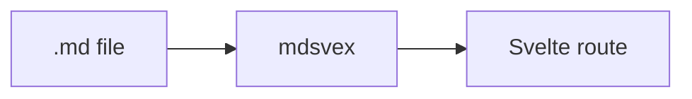

<script>
	import { Callout, FileTree, FileTreeItem } from 'svelte-docsmith';
</script>

## A page is a file

Every page is a `+page.md` file under `src/routes/docs/`. The directory name is
the URL, so this file serves `/docs/guides/routing`:

<FileTree>
	<FileTreeItem name="src" folder>
		<FileTreeItem name="routes" folder>
			<FileTreeItem name="docs" folder>
				<FileTreeItem name="guides" folder>
					<FileTreeItem name="routing" folder>
						<FileTreeItem name="+page.md" highlight />
					</FileTreeItem>
				</FileTreeItem>
			</FileTreeItem>
		</FileTreeItem>
	</FileTreeItem>
</FileTree>

Create the file, and the page exists.

## Frontmatter

The frontmatter block at the top of each page drives the sidebar. Four fields:

| Field         | Required | Purpose                                                                    |
| ------------- | -------- | -------------------------------------------------------------------------- |
| `title`       | yes      | The sidebar label and page heading.                                        |
| `description` | no       | One-line summary, shown under the title.                                   |
| `section`     | no       | Sidebar group, a string or a nested path. Omitted pages fall under "Docs". |
| `order`       | no       | Sort key within the group.                                                 |

```md
---
title: Routing
description: How pages map to URLs.
section: Guides
order: 1
---
```

`section` names the group and `order` sorts within it; groups themselves are
ordered by the smallest `order` they contain.

### Nested sections

Give `section` an array to nest a page inside a collapsible subsection. Each
entry is one level of the group path:

```md
---
title: Middleware
section: [Guides, Advanced]
order: 2
---
```

This puts "Middleware" under a collapsible **Advanced** group inside **Guides**.
Nesting can go as deep as you like, `order` still sorts each level, and a
subsection inherits the smallest `order` of its pages. The branch holding the
current page is expanded on load; the rest start collapsed.

<Callout variant="warning" title="A missing page is almost always frontmatter">

A page with no `title` is skipped by the sidebar. If a page isn't showing up,
check its frontmatter before anything else: a stray indent or a typo'd key is
the usual culprit.

</Callout>

## Headings

Don't write an `#` (h1) in the body. The `title` from frontmatter is the page
heading, so start your content at `##`. Every heading gets an anchor id
automatically, and the in-page table of contents is built from `##` and `###`
headings as the page renders.

## Code blocks

Fenced code blocks are highlighted by Shiki at build time; tag the fence with a
language. To emphasise a line, append the comment `// [!code highlight]` to it
(a real comment in that language). Shiki strips the comment and highlights the
line, like the second line below:

```ts
const docs = loadDocs();
const current = docs.find((d) => d.active); // [!code highlight]
```

Unknown language tags fall back to plain text rather than failing the build, so
an unfamiliar fence won't break your site.

Line highlighting is just the start. See [Code blocks](/docs/code-blocks) for
diffs, focus, error and warning lines, and word highlighting.

## Diagrams

Tag a fence `mermaid` and it renders as a diagram instead of code, via
[Mermaid](https://mermaid.js.org), following the site's light and dark themes:

````md

````

renders as:


Mermaid runs in the browser, so add it to your project. It's an optional peer
dependency, pulled in only on pages that use it:

```bash
npm i -D mermaid
```

## Live examples

To show a real, running component next to its source, put the component in
`src/lib/examples/`. Import `LiveExample`, then import your component twice: once
as the component, and once with the `?source` query for its build-time
highlighted source. Pass both to `LiveExample`:

```md
<script>
  import { LiveExample } from 'svelte-docsmith';
  import Counter from '$lib/examples/counter.svelte';
  import counterSource from '$lib/examples/counter.svelte?source';
</script>

<LiveExample source={counterSource}>
  <Counter />
</LiveExample>
```

Both come from the same file, so the demo you render and the code you show can
never drift. See [Live Examples](/docs/live-examples) for a running one.

## Tabbed content

For alternatives such as package managers or framework variants, group blocks
with `Tabs` and `TabItem`. Pass the tab labels as `items`; each `TabItem`'s
`value` matches one label:

````md
<script>
  import { Tabs, TabItem } from 'svelte-docsmith';
</script>

<Tabs>
<TabItem label="npm">

```bash
npm i -D svelte-docsmith
```

  </TabItem>
  <TabItem label="pnpm">

```bash
pnpm add -D svelte-docsmith
```

  </TabItem>
</Tabs>
````

See the [Components](/docs/components/callout) section for the full set you can
drop into a page: callouts, steps, cards, accordions, file trees, badges, and
more.
